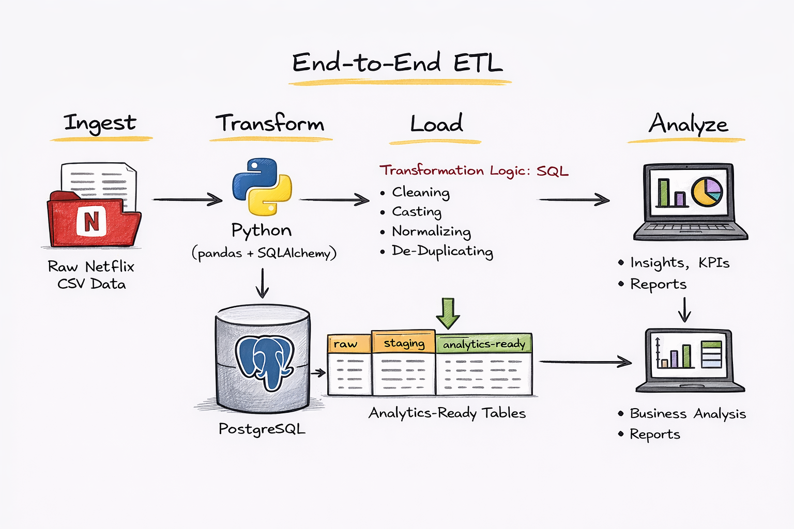

# 🎬 Netflix Data Engineering & SQL Data Cleaning (ETL Project)

An end-to-end **Data Engineering & SQL data cleaning project** focused on transforming raw, messy Netflix data into clean, analytics-ready tables using **ETL Concepts, Python, PostgreSQL, and SQL**.

---

## 📌 Project Overview

This project demonstrates how real-world datasets are cleaned, normalized, and prepared before any meaningful analysis can happen.

Instead of jumping directly into dashboards or visualizations, this project focuses on the **most critical phase of analytics  data preparation**.  
The goal was to take a raw Netflix CSV file and build a clean, structured, and query-optimized database that supports business-level analysis.

## 🏗️ System Architecture

---

## 🧠 What This Project Demonstrates

- End-to-end **ETL workflow** (Extract → Load → Transform)
- SQL-based **data cleaning and normalization**
- Handling **real-world messy data**
- Designing **raw, staging, and analytics layers**
- Writing business-focused analytical queries

---

## 🛠️ Tech Stack

- **Python** (pandas)
- **PostgreSQL**
- **SQL (PostgreSQL dialect)**
- **SQLAlchemy**
- **Jupyter Notebook**
- **VS Code**

---

## 🏗️ Project Architecture

Raw CSV File
    ↓
Python (pandas)
    ↓
PostgreSQL (netflix_raw)
    ↓
SQL Data Cleaning & Transformation
    ↓
Staging Tables
    ↓
Analytics-Ready Tables

---

## 📂 Repository Structure

├── netflix_titles.csv
├── Loading_Data.ipynb
├── Updated_Table_Schema.sql
├── DataPreparation_and_DataStaging.sql
├── Netflix_Data_Analysis_Business_Questions.sql
└── README.md

---

## 🔄 Data Ingestion

The raw Netflix dataset is loaded using **Python (pandas)** and inserted into PostgreSQL using **SQLAlchemy**.

- Supports clean re-runs using `if_exists='replace'`
- Supports incremental loading using `if_exists='append'`
- Data is first stored in a raw table (`netflix_raw`) before any transformations

---

## 🧹 Data Cleaning & Transformation (SQL)

Key data-cleaning techniques applied using PostgreSQL:

### 🔹 Duplicate Handling
- Identified duplicates using case-insensitive business keys (`UPPER(title) + type`)
- Removed duplicates using `ROW_NUMBER()` window functions

### 🔹 Normalization of Multi-Valued Columns
Converted comma-separated text fields into relational tables:
- `director` → `netflix_directors`
- `cast` → `netflix_cast`
- `country` → `netflix_country`
- `listed_in` → `netflix_genre`

Used:
- `string_to_array`
- `UNNEST`
- `CROSS JOIN LATERAL`
- `TRIM`

---

### 🔹 Data Type Standardization
- Converted text-based date fields into `DATE`
- Parsed duration values from strings like `"118 min"` into numeric format
- Enabled time-based and numeric analysis

---

### 🔹 Missing Value Handling & Enrichment
- Handled missing values using `CASE` logic
- Populated missing country values using rule-based SQL inference
- Replaced remaining nulls with standardized placeholders

---

## 📊 Business Questions Answered

The cleaned dataset enables answering real business questions such as:

- Movies vs TV shows created by each director
- Countries with the highest number of comedy movies
- Top directors by year based on Netflix release trends
- Average movie duration by genre
- Directors who have created both comedy and horror movies

---

## 🎯 Key Learnings

- How ETL ( Extract, Transform, Load ) take place.
- Data cleaning often takes more effort than analysis itself
- Normalization is critical for accurate aggregations
- SQL window functions are powerful for de-duplication
- Separating raw, staging, and analytics layers improves maintainability
- Clean data enables reliable business insights

---

## 🚀 Future Improvements

- Improve robustness of date parsing
- Add indexes for performance optimization
- Automate ETL using scheduled jobs
- Add a visualization layer (Power BI / Tableau)

---

## 📬 Contact

If you have suggestions or feedback, feel free to connect with me on LinkedIn.

---

⭐ If you found this project useful, consider starring the repository!

